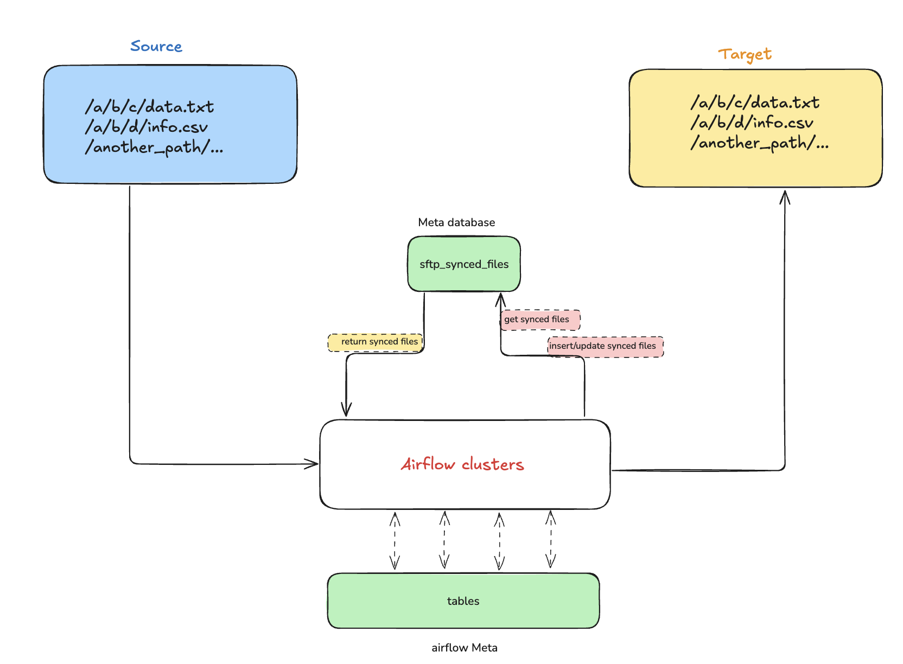

# cake-take-home-test

## Problem Statement
The task involves two SFTP destinations, referred to as <source> and <target>.

Your objective is to develop an Apache Airflow DAG that facilitates the transfer of files from the SFTP server at <source> to the SFTP server at <target> and ensures the preservation of the original directory structure.

The synchronization process should be unidirectional; hence, any modification made on <target> must not impact the <source>.
Deleted files on SFTP server at <source> must remain intact on <target> server.

Examples:
- On March 1st, 2024, when a file named sftp://<source>/a/b/c/file_1.txt is detected on the source server, it should be replicated to sftp://<target>/a/b/c/file_1.txt on the destination server.
- On March 2nd, 2024, a file named sftp://<source>/a/b/c/file_2.txt appears on the source server and subsequently should be transferred to sftp://<target>/a/b/c/file_2.txt on the destination server.
- On March 3rd, 2024, a file named sftp://<source>/a/b/c/file_3.txt appears on the source server and should then be transferred to sftp://<target>/a/b/c/file_3.txt on the destination server.

## Expected Outcome
- Use separated commits that reflect your incremental development and refactoring. Pure atomic commits are not expected, and don’t squash them.
- A docker-compose.yml file for deploying latest Airflow version, with each service (Scheduler, Worker, Web Server) running in a separate container. Utilizing SQLite as the backend is permissible. The use of Celery executor is advised.
- A README.md file that includes:
    - Detailed instructions for setting up and running the project.
    - Any additional initial setup requirements.
    - An explanation of assumptions made, decisions taken, and any trade-offs considered.
    - One or more DAG file(s).
    - Any additional plugins required for the project.

## Approach:
Follow the [link](https://airflow.apache.org/docs/apache-airflow/stable/howto/docker-compose/index.html#fetching-docker-compose-yaml) to set up Airflow in Docker.

Based on the problem requirements, we want to create a process to transfer files between SFTP servers.

### Main requirements:
- Data must be transferred incrementally from source to destination.

- Because "**Deleted files** on the SFTP server at <source> **must remain** on the <destination> server." Therefore, I assume there are no instances of overwriting the file at the source, for example, file_1.txt is deleted, then a content file with the same name file_1.txt is created. File_1.txt at the destination will not be changed.

### Solutions:

- Lookup source path, find files.
- Keep track the synced file to target.
- Compare source files with synced files to find the new files.

### Enhancement:
- CheckSum, Transfer with Chunk Size, Retry on Error.
- Add CustomOperator.
- Store the synced file to Metadata Database with new tables, no need to store synced file in Airflow Variable.

### My observations:
This operator supports optional transformations during file sync.

However, transformations are **not recommended** for production use cases.

For complex or large-scale transformations, use a dedicated data pipeline
after synchronizing raw files.

In real-world data platforms, transformations should be handled as a separate processing stage, for example:
1. Read data from the source system
2. Transform data using a dedicated processing engine
3. Write transformed output to the target system

Typical tools for such pipelines include:
- Apache Spark
- Apache Flink

This separation ensures:
- Clear responsibility boundaries
- Easier observability and debugging
- Correct checksum and data integrity guarantees
- Better scalability for complex transformations
